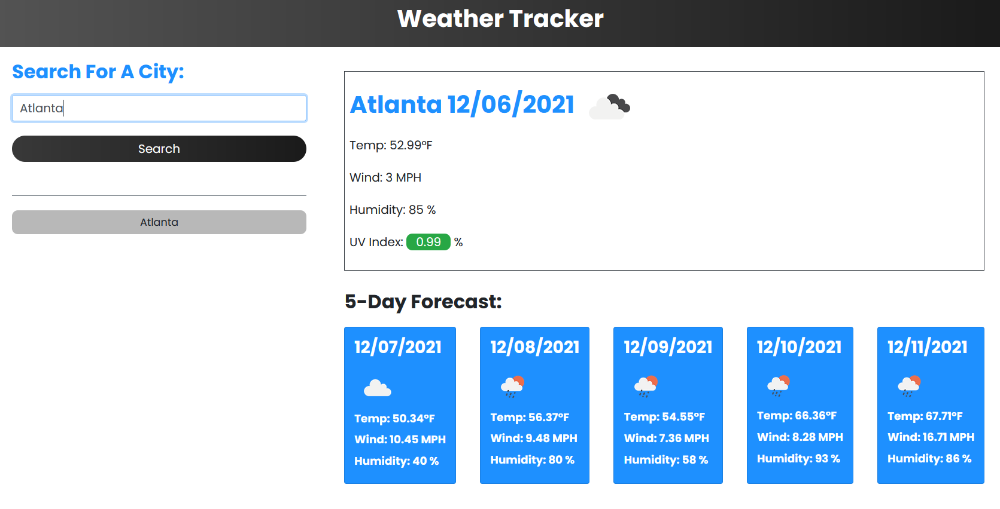

# WeatherTracker

## Description
A tool to get the current weather conditions for any city in the
world. Plus a five-day forecast of that city.

## How To Run Application
1. Git clone the repository
2. Open the folder in a text editor
3. Find index.html and open the file in your browser

## Usage
Type in the city that you wish to view the weather conditions of,
press the button or hit "enter" and the city's weather and future five-day forecast will be displayed. 

The city you searched for will then be displayed in the menu at the left sidebar. You can click the city in the sidebar to bring up the weather conditions again. Up to eight cities can be saved in the menu.

On refresh all previously viewed cities will remain in the sidebar.

## Made With
* HTML
* CSS
* JavaScript
* Moment.js
* Bootstrap

## Website
https://chance-crawford.github.io/WeatherTracker/
